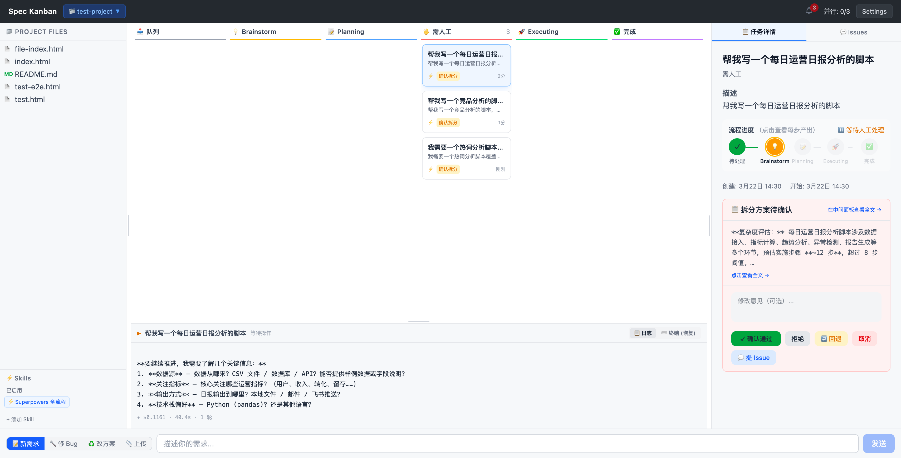
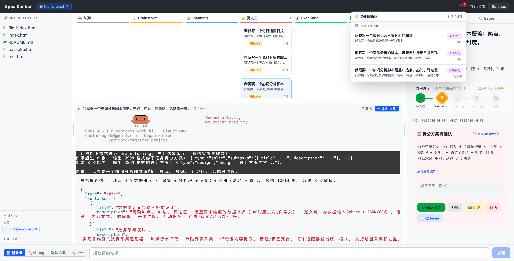
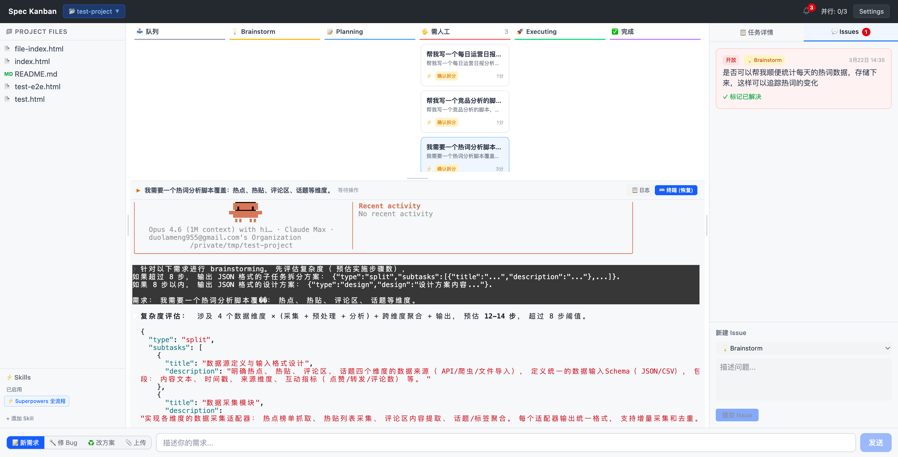
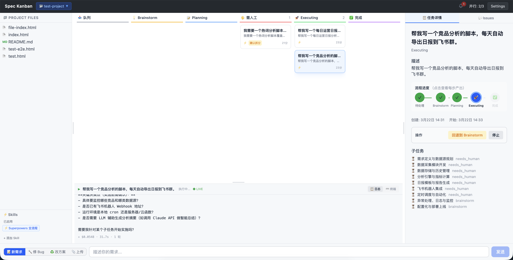

# Spec Kanban

AI 驱动的任务管理系统，拥有类 VS Code 的 IDE 界面。用自然语言创建任务，让 Claude AI 通过结构化工作流自动执行 —— 每个关键步骤都有人工审批门控。

## 界面预览

### 人工审批门控

AI 完成 Brainstorm 后自动暂停，展示方案摘要，等待人工审阅确认后再推进到下一阶段。支持「确认通过」「拒绝」「打回重做」等操作。



### 多任务并行与通知

多个任务同时运行时，红色角标提醒待处理的人工确认数量。终端面板实时展示 Claude Code 的执行输出。



### Issue 反馈系统

对 AI 生成的方案提出修改意见，指定反馈所属阶段。AI 会在下次执行时自动读取 Issue 并调整方案。



### 子任务拆分与执行追踪

复杂需求自动拆解为子任务，每个子任务独立走完 Brainstorm → Planning → Executing 流程，右侧面板实时追踪各子任务状态。



## 功能特性

- **多阶段 AI 工作流** — Brainstorm → Planning → Executing，关键节点人工确认
- **内置技能系统** — Superpowers 全流程、快速修复、代码审查、重构优化、文档生成、测试用例
- **IDE 风格界面** — 文件树、看板、终端、产物预览，三栏布局
- **实时更新** — WebSocket 驱动的任务状态和日志实时推送
- **多项目支持** — 在多个 Git 仓库间无缝切换
- **Issue 反馈系统** — 对 AI 生成的设计和方案提出修改意见
- **终端集成** — xterm.js 嵌入式终端，实时查看执行日志
- **子任务拆分** — 复杂需求自动拆解，各子任务独立执行

## 快速开始

### 前置条件

- Node.js 18+
- 已安装 [Claude Code CLI](https://docs.anthropic.com/en/docs/claude-code)

### 安装与运行

```bash
git clone https://github.com/yunafang/Spec-Kanban.git
cd Spec-Kanban
npm install
npm run dev
```

打开 http://localhost:5173

### 导入项目

```bash
npm run dev -- --project /path/to/your/git/repo
```

## 命令

| 命令 | 说明 |
|------|------|
| `npm run dev` | 启动开发服务器（含项目 CLI） |
| `npm run dev:vite` | 仅启动 Vite 开发服务器 |
| `npm run build` | 生产环境构建 |
| `npm run preview` | 预览生产构建 |

## 技术栈

- **前端**: React、Zustand、Tailwind CSS、xterm.js
- **后端**: Express（Vite 插件模式）、WebSocket、node-pty
- **AI**: Claude Code CLI
- **构建**: Vite、TypeScript

## 鸣谢

本项目的核心工作流理念源自 [Superpowers](https://github.com/nicekid1/Superpowers) 方法论。"Brainstorm → Planning → Executing" 的多阶段范式以及人工审批门控机制，均受到 Superpowers 在 AI 辅助开发领域的启发。感谢 Superpowers 项目的开创性工作。

## 开源协议

[MIT](LICENSE)
