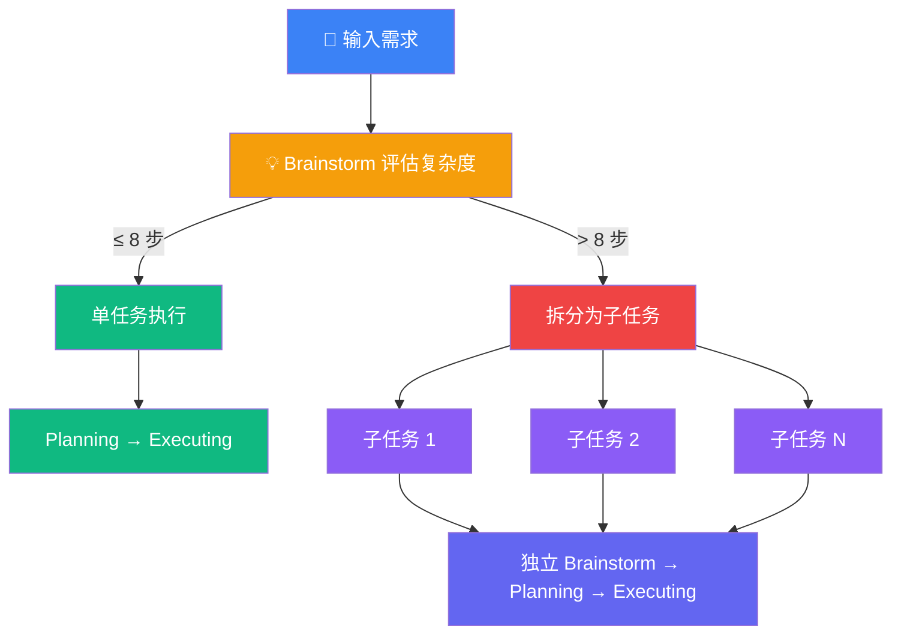
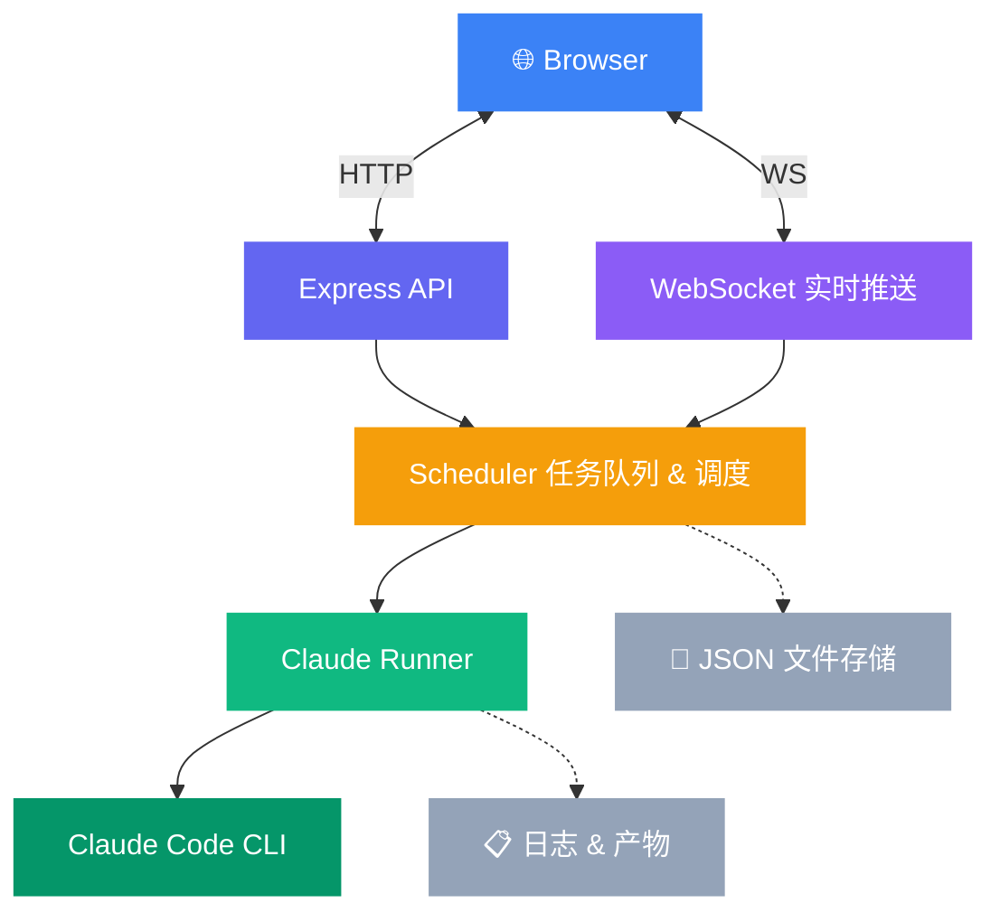

# Spec Kanban

> 让 AI 帮你写代码，你只需要说「做什么」和「行不行」。

## 问题

Vibe Coding 正在成为主流开发方式，但当你真正用 AI 写项目时，很快会踩到这些坑：

- **没有标准 SOP** —— 每次提需求全靠手感，同样的任务不同时候产出质量天差地别。Vibe Coding 缺少一套可复用的流程来约束 AI 的行为，产出完全不可预期
- **没有任务追踪** —— AI 在后台写代码，你完全不知道它在干什么。写完才发现方向跑偏，中间过程无从回溯，出了问题只能从头再来
- **缺乏并发管理** —— 你想同时推进多个需求，但只能一个窗口一个窗口地盯着。开了 3 个 Claude 窗口，注意力反而被切碎，效率回到人工时代
- **上下文爆炸** —— 一个稍复杂的需求，AI 写到中后段 token 耗尽，前面精心设计的架构被「遗忘」，后半段代码和前半段自相矛盾
- **任务调度全靠人** —— 你需要自己判断一个需求该不该拆、拆成几个、每个子任务交给哪个 Agent。这种「人肉调度」本身就消耗了大量的认知资源，而这恰恰是 AI 应该帮你做的事

这些不是工具的 Bug，而是 Vibe Coding 模式本身缺少一层 **任务管理和流程控制**。

Spec Kanban 就是这一层。

## 解决方案

Spec Kanban 借鉴了 [Superpowers](https://github.com/nicekid1/Superpowers) 的核心理念 —— 将 AI 编程从「一句话扔进去祈祷」变成一套 **结构化的 SOP 流程**。

Superpowers 提出了 **Brainstorm → Planning → Executing** 的三阶段范式：AI 不是拿到需求就埋头写代码，而是先构思设计方案，再制定实施计划，最后才动手编码。每个阶段之间设置人工审批门控，确保方向正确后再推进。

Spec Kanban 将这套方法论产品化。你用自然语言描述需求，系统自动走完全流程，但在每一个关键节点自动暂停，等你审阅确认后再继续。同时加入了任务追踪、并发管理、自动拆分等工程化能力，让这套 SOP 能真正跑起来。

你不需要盯着 AI 写代码，但你对每一步都有完全的掌控权。


### 你只需要做两件事

1. **输入需求** —— 用自然语言描述你要做什么
2. **审批方案** —— AI 给出设计/计划后，你决定「通过」「打回」还是「提意见」

剩下的，交给 AI。

## 核心设计

### 为什么接入终端？—— 透明即信任

很多 AI 编程工具像一个黑盒：你提交需求，等结果出来。中间发生了什么，你一无所知。

Spec Kanban 在界面底部嵌入了实时终端，直接展示 Claude Code 的执行输出。你可以随时看到 AI 正在读哪个文件、写了什么代码、遇到了什么问题。

**不是因为你需要看，而是因为你能看，所以你才敢放手。**


### 为什么拆分任务？—— 8 步原则

AI 模型有上下文窗口的限制。一个复杂需求如果不拆分，AI 会在执行中后段逐渐「遗忘」前面的设计意图，导致产出质量下降甚至逻辑不一致。

Spec Kanban 在 Brainstorm 阶段自动评估需求复杂度：



- **≤ 8 步可完成** → 作为单个任务直接执行，上下文充足，质量有保障
- **> 8 步才能完成** → 自动拆分为多个子任务，每个子任务独立走完全流程

这个「8 步原则」不是随意设定的。它是在实际使用中验证出的一个平衡点：足够小以确保 AI 不丢失上下文，又足够大以避免拆分过碎导致子任务之间缺乏连贯性。

每个子任务拥有独立的 Brainstorm → Planning → Executing 生命周期和独立的 session，互不干扰。


### 为什么要人工审批？—— 你是决策者，AI 是执行者

AI 擅长执行，但不擅长判断「该不该做」和「做得对不对」。Spec Kanban 的每个 Skill 都定义了明确的阶段和人工门控：


你在确认方案时可以：
- **通过** —— 方案没问题，继续推进
- **打回** —— 方向不对，回到 Brainstorm 重新思考
- **提 Issue** —— 大体可以，但某些细节需要调整

AI 会读取你的 Issue 反馈，在下次执行时自动纳入考量。


### 架构：一个服务，全部搞定

Spec Kanban 采用极简架构。所有功能运行在 **同一个进程** 内：



> 所有模块运行在同一个 Vite Dev Server 进程内（port 5173）

没有微服务，没有消息队列，没有数据库。任务数据存在 JSON 文件里，日志和产物存在本地文件系统。`npm run dev` 一个命令启动全部。

这是有意为之的 —— 这是一个本地开发工具，不是分布式系统。简单意味着可靠。

## 快速开始

### 前置条件

- Node.js 18+
- 已安装 [Claude Code CLI](https://docs.anthropic.com/en/docs/claude-code)

### 安装与运行

```bash
git clone https://github.com/yunafang/Spec-Kanban.git
cd Spec-Kanban
npm install
npm run dev
```

打开 http://localhost:5173

### 导入项目

```bash
npm run dev -- --project /path/to/your/git/repo
```

## 内置技能

| 技能 | 说明 | 流程 |
|------|------|------|
| ⚡ Superpowers 全流程 | 完整的设计→计划→执行流程 | Brainstorm → Planning → Executing |
| 🔧 快速修复 | Bug 修复和小改动 | Executing |
| 🔍 代码审查 | AI 审查代码质量 | Brainstorm（审查分析） |
| ♻️ 重构优化 | 先出方案再执行 | Brainstorm → Executing |
| 📖 文档生成 | 分析代码生成文档 | Brainstorm → Executing |
| 🧪 测试用例 | TDD 风格测试生成 | Planning → Executing |

## 技术栈

- **前端**: React、Zustand、Tailwind CSS、xterm.js
- **后端**: Express（Vite 插件）、WebSocket、node-pty
- **AI**: Claude Code CLI
- **构建**: Vite、TypeScript

## 鸣谢

本项目的核心工作流理念源自 [Superpowers](https://github.com/nicekid1/Superpowers) 方法论。"Brainstorm → Planning → Executing" 的多阶段范式以及人工审批门控机制，均受到 Superpowers 在 AI 辅助开发领域的启发。感谢 Superpowers 项目的开创性工作。

## 开源协议

[MIT](LICENSE)
